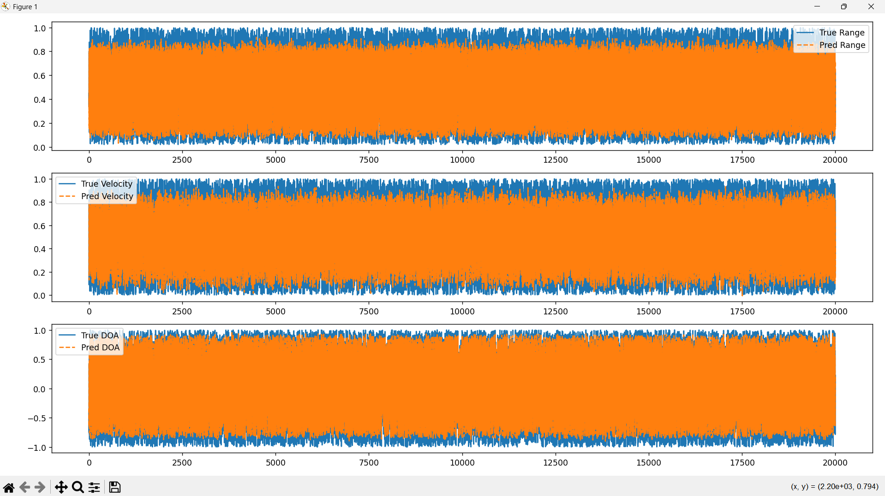

# Software(AI Model) Prototype Screenshots
**1.Predicted Range, Velocity and DOA Plots**  
 
This figure shows predicted values in orange and actual values in blue by AI model, it is very clear through image that model is working well and have good learning on the provided dataset.

**2.Evaluation Measures and True v/s Predicted Table**  
 
This figure shows Range Root Mean Square Error, Velocity Mean Absolute Error and DOA MAE score. It is clear by image and that these scores are very less means model is working well. Another important thing in the figure is that true values and predicted values are very near to each other again proving the model has learned well and have high accuracy.

**3.Predicted v/s Actual Path(UAV Trajectory)**  
 
This figure shows UAV Trajectory where red is of predicted and blue is of original. 
